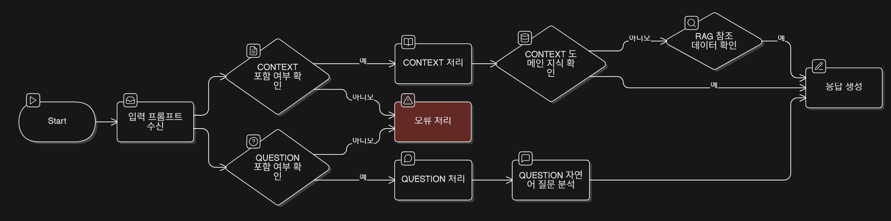
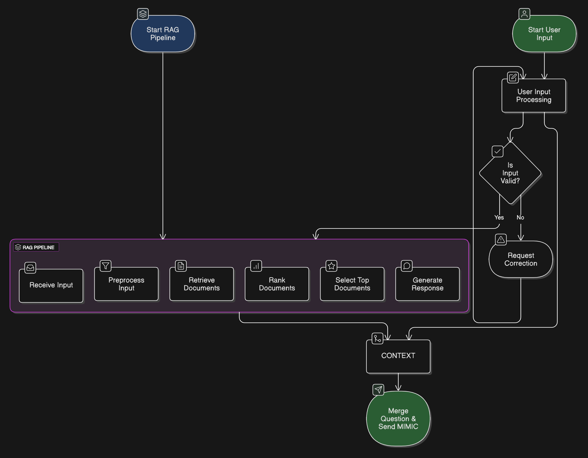
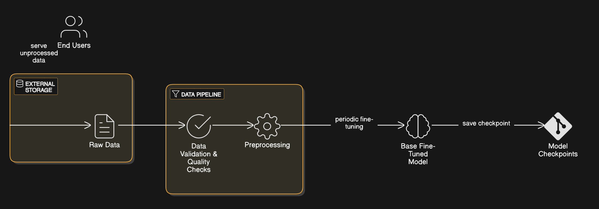

# MIMIC


## MIMIC이 무엇인가요?

MIMIC은 LLAMA3 아키텍처를 기반으로 파인튜닝 되었으며, 한국어에 특화되어 있습니다.
또한 특징으로는 강력한 도메인을 지닌 sLLM은 아니지만 [CONTEXT]-[QUESTION] 프롬프트 형식으로 환각 내성을 지니도록 학습되었습니다.
물론 아직은 출시 poc(proof of concept)단계이기 때문에 완벽한 환각 내성이 되지는 않지만,
6월 이후 추가 확보 가능한 컴퓨팅 리소스를 확보한 뒤, 높은 환각 내성을 지닌 모델로 준비중입니다.

## MIMIC의 올바른 데이터 파이프라인 설계는 어떻게 진행해야 하나요?


기본적으로 MIMIC은 [CONTEXT]-[QUESTION] 프롬프트 구조로 CONTEXT에 제시된 내용을 기반으로 환각을 제어하고 올바른 정답을 도출 할 수 있습니다.CONTEXT가 비어있는 경우 기본적으로 학습된 도메인 지식으로 추론하지만 이 경우 환각(#issue1)이 발생할 수 있습니다.

- #issue1의 경우 6월 이후 컴퓨팅 리소스를 확보한 뒤, 1순위 해결 과제입니다.

## MIMIC 프롬프트를 올바른게 서비스 내에 구성하는 방법은 무엇입니까?



MIMIC의 가장 큰 장점은 기존 RAG 서비스 아키텍처에서 큰 변동이 없다는 것입니다.
기존 RAG 서비스 아키텍처는 크게 2가지 입니다.

#### CASE1

**[유저응답] -> [VectorDB/GraphDB] -> [RANK된 최종응답]**

#### CASE2

**[유저응답] -> [VectorDB/GraphDB] -> [LLM이 가공] -> [가공된 최종응답]**

MIMIC은 여기서 변경사항이 없습니다.

#### CASE1 + MIMIC

**[유저응답] -> [VectorDB/GraphDB] -> [MIMIC] -> [가공된 최종응답]**

#### CASE2 + MIMIC

**[유저응답] -> [VectorDB/GraphDB] -> [MIMIC] -> [가공된 최종응답]**

### 가공응답이라면 기존 GPT모델이나 Gemini, DeepSeek 등이 유리하지 않나요?

맞습니다. 다만 여기 몇몇 가지 MIMIC의 이점이 존재합니다

- MIMIC은 GPU 4GB에서부터 배포가 가능하기 때문에 매우 값싼 설정이 가능합니다.
- 소형기기 등에서 별도의 네트워크 없이 standalone으로 동작 가능합니다.
- 외부에 공개하고 싶지않은 내부 논문, 자료 데이터 등을 노출시키지 않고 제공할 수 있습니다.

### 그렇다면 애초에 작은 모델을 도메인 맞게 잘 학습시키면 해결될 부분 아닌가요?

여기서 MIMIC이 추구하는 관점이 조금 다릅니다.

- MIMIC 역시 특정 도메인에 맞게 추가 조정이 가능합니다.
- MIMIC의 가장 큰 특징은 미세조정되지 않은 MIMIC이 다양한 데이터 저장소와 결합하여 분야별로 뻗어나갈 수 있다는 것입니다.
- 또한 데이터 저장소와 결합하여 즉시 정보를 서빙할 수 있기 때문에 실시간 업데이트가 가능합니다.

## 권장하는 MIMIC의 가장 좋은 운영 예시



- 예를 들어, 특정 요소에 관한 다양한 의견 및 결과들은 미세조정 여러 쌍으로 전처리하기 어렵습니다. (특정제품에 대한 다수의 리뷰 등)
- 또한 초기 도메인에 학습이 가능한만큼의 데이터를 학습시키는 것 역시 어렵습니다. (특정 제품 설명서 정도라면)
- 이러한 미세조정 데이터로 처리하기 어렵지만 유저에게 제공해야하는 데이터는 외부저장소를 통해 CONTEXT로 저장합니다.
- 특수 도메인의 경우, 해당 도메인의 어휘 등은 MIMIC에 별도로 SFT를 진행합니다.
- 그 후 SFT된 MIMIC은 외부저장소와 결합하여 CONTEXT를 주입받고 유저에게 응답을 하며, 외부 저장소에서 주기적으로 미세조정 가능한 전처리된 데이터는 MIMIC에 추가적인 조정을 진행합니다.

#### MIMIC에서 주장하는 아키텍처는 기존 Llama, Qwen, Gemma 등에서도 외부저장소와 결합하여 충분히 실행가능한 논리입니다. 이 주장이 MIMIC이 특별하다는 뒷받침이 됩니까?

맞습니다. 그러나 적어도 한국어에서는 가능합니다.
아래는 제공된 내용을 기반으로 모델들이 서빙하는 응답 수준을 비교하였습니다.
응답에 대한 채점은 ChatGPT O3-고급이성을 기준으로 채점하였습니다.

모든 모델을 테스트할 수 없기에 한국어 성능이 우수한 몇몇 모델을 대상으로 진행하였습니다.
성능 평가 기준은 토크나이저입니다. 아무리 많은 한국어 데이터로 하위 토큰 레버리지를 커버하더라도 기본적인 토크나이저 성능이 실제 성능에 많은 영향을 미치기 때문입니다.

**=== Tokenizer evaluation (5만 문장 × 2개 언어) ===**
| Tokenizer | KO_tokens/char | KO_avg_tokens | KO_p90_tokens | KO_tok_per_sec | EN_tokens/char | EN_avg_tokens | EN_p90_tokens | EN_tok_per_sec |
|:----------------------------------|-----------------:|----------------:|----------------:|-----------------:|-----------------:|----------------:|----------------:|-----------------:|
| Llama‑3.2‑3B | 0.6609 | 37.3457 | 102 | 35859.3 | 0.2261 | 66.2079 | 203 | 26576.2 |
| Gemma‑3‑4B‑IT | 0.6192 | 34.987 | 96 | 46448.5 | 0.2272 | 66.5303 | 202.1 | 27346.2 |
| Qwen2.5 | 0.7408 | 41.8594 | 115 | 33100.6 | 0.2338 | 68.4736 | 210 | 10639.7 |
| llama-3.2-Korean-Bllossom-AICA-5B | 0.6614 | 37.3705 | 103 | 38945 | 0.2261 | 66.2079 | 203 | 20137.1 |
| EXAONE-3.5-2.4B-Instruct | 0.5447 | 30.7764 | 85 | 34157.4 | 0.2413 | 70.6797 | 217 | 18611.9 |
| EXAONE-Deep-7.8B | 0.5447 | 30.7764 | 85 | 34455.4 | 0.2413 | 70.6797 | 217 | 18865.2 |
| EEVE-Korean-Instruct-10.8B-v1.0 | 0.5757 | 32.5323 | 89 | 57444.6 | 0.257 | 75.268 | 229 | 28110.3 |
| kanana-nano-2.1b-instruct | 0.6609 | 37.3457 | 102 | 35752.1 | 0.2261 | 66.2079 | 203 | 26841.7 |

현재 제시된 지표내부에서는 LG에서 개발한 EXAONE 모델이 가장 좋은 토크나이저 성능을 보여하고 있습니다.
그 외 야놀자의 EEVE 굉장히 우수하며, 카카오 및 bllossom에서 개발한 모델의 토크나이저는 구글의 Gemma3보다 낮게 나오지만 내장 SFT 데이터량이 존재하니, 비교군은 Gemma-3, LLama-3-Bllossom-AICA, EXAONE, EXANE-Deep, EEVE, Kanana입니다.
다만 모델 별로 파라미터가 다르기 때문에 불평등한 편차가 발생하겠지만 최선의 수로 비교하겠습니다. [LLM의 경우 저점과 고점이 존재하므로 5번 응답 시도 후 중복 수가 가장많은 응답을 채택하였습니다.]

#### 복잡한 CONTEXT 응답 CASE (정식적인 평가 프로세스가 아니기 때문에 참고용으로 부탁드립니다.)

##### 불분명한 리뷰에 대한 평가

```sh
[CONTEXT]
n리뷰 A (헤드셋)
“이 헤드셋은 한 번 충전으로 최대 30시간까지 사용 가능해서, 장시간 비행 중에도 배터리 걱정이 없었어요. 노이즈 캔슬링을 켜면 조금 단축되지만, 그래도 25시간 이상은 충분히 갑니다. 착용감도 편안해서 장시간 청취해도 귀가 아프지 않았습니다.”

리뷰 B (스마트폰)
“새 스마트폰은 화면이 90Hz인데도 배터리가 금방 닳더라고요. 평소 웹서핑만 해도 12시간 정도고, 게임하면 4~5시간에 배터리 알림이 뜹니다. 빠른 충전(30분에 50%)은 만족스럽지만, 하루 종일 쓰기엔 약간 불안해요.”

리뷰 C (헤드셋)
“음질과 통화 품질은 훌륭한데, 무선 연결 강도가 약할 때 배터리 표시가 깜빡거리면서 잔여 시간이 실제보다 2시간 정도 적게 표시되곤 했습니다. 그래도 실제 재생 가능한 시간은 28~29시간 정도로, 스펙과 크게 다르지 않았습니다.”

리뷰 D (노트북)
“이 노트북으로 영상 편집하면서 배터리가 8시간 정도 가더라고요. CPU 로드가 높으면 5시간 이하로 떨어지고, 화면 밝기만 낮추면 10시간도 가능했습니다.”

리뷰 E (헤드셋)
“빠른 페어링과 충전 케이스 덕분에 출근길에 10분만 충전해도 5시간은 쓸 수 있었어요. 풀 충전 시에는 공식 스펙대로 30시간 넘겼고, 여러 기기 간 스위칭도 배터리 소모가 크지 않았습니다.”

[QUESTION]
무선 헤드셋의 배터리 지속 시간에 대한 사용자 평가는 어떠한가요?
```

```sh
MIMIC 외 모델에게 해당 프롬프트는 불공평하다 판단하여 해당 외 모델들에게는

[“이 헤드셋은 한 번 충전으로 최대 30시간까지 사용 가능해서, 장시간 비행 중에도 배터리 걱정이 없었어요. 노이즈 캔슬링을 켜면 조금 단축되지만, 그래도 25시간 이상은 충분히 갑니다. 착용감도 편안해서 장시간 청취해도 귀가 아프지 않았습니다.”

리뷰 B (스마트폰)
“새 스마트폰은 화면이 90Hz인데도 배터리가 금방 닳더라고요. 평소 웹서핑만 해도 12시간 정도고, 게임하면 4~5시간에 배터리 알림이 뜹니다. 빠른 충전(30분에 50%)은 만족스럽지만, 하루 종일 쓰기엔 약간 불안해요.”

리뷰 C (헤드셋)
“음질과 통화 품질은 훌륭한데, 무선 연결 강도가 약할 때 배터리 표시가 깜빡거리면서 잔여 시간이 실제보다 2시간 정도 적게 표시되곤 했습니다. 그래도 실제 재생 가능한 시간은 28~29시간 정도로, 스펙과 크게 다르지 않았습니다.”

리뷰 D (노트북)
“이 노트북으로 영상 편집하면서 배터리가 8시간 정도 가더라고요. CPU 로드가 높으면 5시간 이하로 떨어지고, 화면 밝기만 낮추면 10시간도 가능했습니다.”

리뷰 E (헤드셋)
“빠른 페어링과 충전 케이스 덕분에 출근길에 10분만 충전해도 5시간은 쓸 수 있었어요. 풀 충전 시에는 공식 스펙대로 30시간 넘겼고, 여러 기기 간 스위칭도 배터리 소모가 크지 않았습니다.”]
위 데이터를 기반으로 필요한 내용을 참고하여 유저 질문에 응답하시오.
질문: 무선 헤드셋의 배터리 지속 시간에 대한 사용자 평가는 어떠한가요?

프롬프트로 진행하였습니다.
```

|               모델                | 파라미터 | 응답 | 점수 |                                                                                   점수 측정 기준                                                                                    | 환각 저항 |
| :-------------------------------: | :------: | :--: | :--: | :---------------------------------------------------------------------------------------------------------------------------------------------------------------------------------: | :-------: |
|            Gemma-3-4b             |  40억개  | [1]  |  6   | 헤드셋 배터리 시간(25 ~ 30 h)을 정확히 잡았지만, 스마트폰 리뷰 B를 “노이즈 캔슬링” 예시로 잘못 인용하고 노트북 D의 CPU 로드를 헤드셋 변수처럼 언급하는 등 불필요·부정확 정보가 섞임 |    ❌     |
| llama-3.2-Korean-Bllossom-AICA-5B |  50억개  | [2]  |  5   |                              각 리뷰를 그대로 나열했으나 스마트폰 B·노트북 D까지 포함해 질문 범위를 벗어남. 사실 관계 오류는 없지만 핵심 요약력이 낮음                              |    ✅     |
|     EXAONE-3.5-2.4B-Instruct      |  40억개  | [3]  |  6   |                              장점·단점 구조는 좋으나 스마트폰 B의 “빠른 충전”을 헤드셋 장점으로 오해하는 등 일부 잘못된 인용. 핵심 정보는 대체로 맞음                               |    ❌     |
|               EEVE                |  80억개  | [4]  |  9   |                                   헤드셋 관련 리뷰(A · C · E)만 활용해 배터리 지속 시간과 변동 요인을 정확·간결하게 정리. 불필요한 기기 정보 없음                                   |    ✅     |
|              kanana               |  21억개  | [5]  |  9   |                                       헤드셋 리뷰만 선별, 주요 수치·특징을 정확히 요약. 배터리 표시 오류(리뷰 C)까지 반영해 정보 완전성 높음                                        |    ✅     |
|               MIMIC               |  15억개  | [6]  |  8   |                     긍정-중립 포인트를 균형 있게 제시. 리뷰 C의 표시 오류도 언급. 다만 25 h 이상(리뷰 A)·30 h 초과(리뷰 E)만 강조돼 변동 요인 설명은 다소 부족                      |    ✅     |

[1]

<details>
<summary>Gemma-3-4b 응답 보기</summary>
위 리뷰들을 종합해 보면, 무선 헤드셋의 배터리 지속 시간은 **전반적으로 긍정적**이지만, 몇 가지 변수가 존재합니다.

- **최대 지속 시간:** 대부분의 헤드셋은 공식 스펙인 30시간을 넘어가는 경우가 있습니다. 리뷰 E에서는 "30시간 넘겼고", 리뷰 C에서는 "28~29시간 정도로, 스펙과 크게 다르지 않았습니다"라고 언급했습니다.
- **사용 환경에 따른 변동:** 사용 환경에 따라 배터리 지속 시간이 크게 달라질 수 있습니다.
  - **노이즈 캔슬링:** 노이즈 캔슬링 기능 사용 시 배터리가 단축됩니다. (리뷰 B)
  - **무선 연결 강도:** 무선 연결이 약할 경우 배터리 표시가 부정확하게 나타날 수 있습니다. (리뷰 C)
  - **CPU 로드 (노트북):** 노트북의 경우, CPU 로드가 높으면 배터리 소모가 증가합니다. (리뷰 D)
- **편리한 충전:** 빠른 충전 기능과 충전 케이스를 통해 짧은 시간 안에 배터리를 충전하여 사용할 수 있다는 긍정적인 평가가 많습니다. (리뷰 E)

결론적으로, 무선 헤드셋의 배터리 지속 시간은 사용자 환경 및 사용 패턴에 따라 달라질 수 있지만, **충분히 장시간 사용이 가능하다**는 평가가 주를 이룹니다.

</details>

[2]

<details>
<summary>llama-3.2-Korean-Bllossom-AICA-5B 응답 보기</summary>
무선 헤드셋의 배터리 지속 시간에 대한 사용자 평가는 다음과 같습니다.

- 리뷰 A: 25시간 이상으로 충분하다고 설명하며, 장시간 비행 중에도 배터리 걱정이 없다고 명시합니다.
- 리뷰 B: 스마트폰의 빠른 충전 기능을 만족하지만, 하루 종일 사용이 조금 불편하다고 평가합니다.
- 리뷰 C: 무선 연결 강도가 약할 때 배터리 표시가 깜빡이며, 실제 재생 가능 시간은 28~29시간 정도라고 설명합니다.
- 리뷰 D: 노트북을 편집하면서 8시간 정도의 배터리 소모가 나타났으며, 화면 밝기 조절에 따라 사용 시간이 달라진다고 언급합니다.
- 리뷰 E: 빠른 페어링과 충전 기능을 통해 출근길에 10분만 충전해도 5시간 이상 쓸 수 있다고 평가하며, 공식 스펙대로 30시간까지 사용할 수 있다고 설명합니다.

이러한 리뷰들에서 무선 헤드셋의 배터리 지속 시간에 대한 긍정적 및 부정적 평가가 모두 포함되어 있으며, 각 제품마다 사용 상황과 환경에 따라 다른 경험을 나타내고 있습니다.

</details>

[3]

<details>
<summary>EXAONE-3.5-2.4B-Instruct 응답 보기</summary>
무선 헤드셋의 배터리 지속 시간에 대한 사용자 평가는 대체로 긍정적이지만, 몇 가지 중요한 고려사항이 함께 제시되고 있습니다:

1. **장점**:

   - **장시간 사용 가능**: 리뷰에서 언급된 헤드셋은 한 번 충전으로 최대 **30시간**까지 사용 가능하다는 점이 강조되었습니다. 특히 리뷰 A와 E에서는 이 스펙이 실제 사용 경험에서도 잘 유지되었다고 평가되었습니다.
   - **편안한 착용감**: 장시간 착용해도 불편함이 없다는 점이 언급되어, 배터리 수명 외에도 사용자 경험의 중요한 요소로 작용하고 있음을 보여줍니다.
   - **빠른 충전 기능**: 일부 모델에서 빠른 충전 기능이 제공되어 짧은 시간 내에 상당 부분의 배터리를 보충할 수 있다는 장점이 있습니다. 리뷰 B에서는 빠른 충전 기능이 만족스럽다고 언급되었습니다.

2. **단점 및 고려사항**:
   - **노이즈 캔슬링 기능**: 노이즈 캔슬링 기능을 활성화하면 배터리 수명이 약간 단축될 수 있다는 점이 지적되었습니다 (리뷰 A).
   - **무선 연결 강도**: 무선 연결의 강도가 약할 때 배터리 표시가 실제보다 짧게 보일 수 있다는 점이 언급되었습니다 (리뷰 C). 하지만 실제 사용 가능 시간은 스펙에 가깝게 유지되는 경향이 있었습니다.
   - **환경적 요인**: 리뷰 D에서 노트북의 경우와 마찬가지로, CPU 로드가 높거나 화면 밝기가 높을 때 배터리 수명이 줄어들 수 있다는 점이 지적되었습니다. 이는 무선 헤드셋에서도 비슷한 영향을 미칠 수 있음을 시사합니다.
   - **기기 간 스위칭**: 여러 기기 간의 스위칭이 배터리 소모에 큰 영향을 미치지 않는다는 점이 긍정적으로 평가되었지만, 이는 특정 모델에 따라 다를 수 있습니다.

결론적으로, 무선 헤드셋의 배터리 지속 시간은 매우 만족스러운 수준으로 평가되지만, 사용자 환경과 설정에 따라 약간의 변동이 있을 수 있다는 점을 고려해야 합니다. 특히 노이즈 캔슬링이나 연결 상태 등이 배터리 수명에 영향을 미칠 수 있다는 점이 중요한 참고사항입니다.

</details>

[4]

<details>
<summary>EEVE 응답 보기</summary>
사용자 리뷰를 바탕으로 무선 헤드셋의 배터리 지속 시간에 대한 평가는 대체로 긍정적입니다. 사용자들은 헤드셋이 한 번 충전으로 최대 30시간까지 사용할 수 있다고 언급했으며, 이는 장시간 비행 중에도 배터리 걱정이 없게 해줍니다. 노이즈 캔슬링을 사용할 때는 배터리 수명이 약간 줄어들지만, 여전히 25시간 이상을 사용할 수 있습니다. 또한, 사용자들은 헤드셋의 착용감이 편안하다고 느꼈으며, 장시간 청취해도 귀가 아프지 않았다고 합니다.

리뷰 C에서 언급된 것처럼, 무선 연결이 약할 때 배터리 표시가 깜빡이며 잔여 시간이 실제보다 적게 표시되는 문제가 있었습니다. 하지만 실제 재생 가능한 시간은 스펙과 크게 다르지 않았습니다.

전반적으로, 사용자들은 헤드셋의 배터리 지속 시간을 만족스럽게 여기며, 빠른 충전 기능과 여러 기기 간 스위칭 시에도 배터리 소모가 크지 않다는 점을 높이 평가하고 있습니다.

</details>

[5]

<details>
<summary>kanana 응답 보기</summary>
무선 헤드셋의 배터리 지속 시간에 대한 사용자 평가는 대체로 긍정적입니다. 다음은 주요 사용자 리뷰를 기반으로 한 평가입니다:

1. **리뷰 A**: "이 헤드셋은 한 번 충전으로 최대 30시간까지 사용 가능해서, 장시간 비행 중에도 배터리 걱정이 없었습니다. 노이즈 캔슬링을 켜면 조금 단축되지만, 그래도 25시간 이상은 충분히 갑니다. 착용감도 편안해서 장시간 청취해도 귀가 아프지 않았습니다."

   - **평가**: 매우 만족, 장시간 사용 가능, 편안한 착용감

2. **리뷰 C**: "음질과 통화 품질은 훌륭한데, 무선 연결 강도가 약할 때 배터리 표시가 깜빡거리면서 잔여 시간이 실제보다 2시간 정도 적게 표시되곤 했습니다. 그래도 실제 재생 가능한 시간은 28~29시간 정도로, 스펙과 크게 다르지 않았습니다."

   - **평가**: 만족, 배터리 표시 오류가 있지만 실제 사용 시간은 스펙과 일치

3. **리뷰 E**: "빠른 페어링과 충전 케이스 덕분에 출근길에 10분만 충전해도 5시간은 쓸 수 있었어요. 풀 충전 시에는 공식 스펙대로 30시간 넘겼고, 여러 기기 간 스위칭도 배터리 소모가 크지 않았습니다."
   - **평가**: 매우 만족, 빠른 충전, 여러 기기 간 사용 가능

전반적으로 사용자들은 무선 헤드셋의 배터리 지속 시간이 충분히 길고, 다양한 상황에서 유용하게 사용할 수 있다고 평가하고 있습니다. 다만, 일부 사용자들은 무선 연결 강도 문제로 인해 배터리 표시가 오류를 보일 수 있다는 점을 지적했지만, 실제 사용 시간은 스펙과 일치한다고 합니다.

</details>

[6]

<details>
<summary>MIMIC 응답 보기</summary>
사용자 평가:\n리뷰 A와 리뷰 E는 헤드셋의 배터리 지속 시간에 대해 긍정적인 평가를 하고 있습니다. 리뷰 A는 최대 30시간 사용 가능하며, 리뷰 E는 풀 충전 시 30시간 이상 사용 가능하다는 점에서 배터리 지속성에 대해 만족감을 표현하고 있습니다. 리뷰 C는 배터리 표시가 깜빡이는 현상을 언급하며, 실제 재생 가능한 시간은 28~29시간 정도로 언급하여 약간의 문제를 지적하고 있습니다. 리뷰 D는 노트북에 대한 평가는 배터리 지속 시간과는 관련이 없으므로 해당되지 않습니다.
</details>

##### llama-3.2-Korean-Bllossom-AICA-5B는 탈락처리, 사람이 파악하기 어려운 질문에 대한 환각 저항

```sh
[CONTEXT]
“출장 3일 째, 공항 대합실 벤치에서 ‘활어 회’처럼 쪽잠을 뒤척이다가도 헤드셋 배터리는 칭얼대는 기색 한 번 안 보이더니 스펙서 30시간? 글쎄, **잔량 15 %**쯤 남았을 때 노이캔 ON 하고 ‘백색소음 → 재즈 → ASMR’로 연속 재생해도
밤 10시 ‘마감 콜’까진 버티더라.
다만 서울↔부산 KTX처럼 전파 들쭉날쭉한 구간에선 LED 지시등이 황→적→황 왔다 갔다, 실재보다 2~3시간 과소 표시해서 괜히 마음 졸였음.
…그래도 케이스 10 분 급속 = ‘맥콜 한 캔’ 기다리는 사이 5 시간 분량 채워주니, ‘배터리 걱정’이 걱정할 걱정거리는 아닌 셈.
(※ 참고: 전작 V3-Pro는 같은 시나리오에서 새벽 2시에 뻗어버렸음.)”

[QUESTION]
사용자가 사실상 지적한 유일한 ‘배터리 관련 불편’은 무엇인가?
```

```sh

[“출장 3일 째, 공항 대합실 벤치에서 ‘활어 회’처럼 쪽잠을 뒤척이다가도 헤드셋 배터리는 칭얼대는 기색 한 번 안 보이더니 스펙서 30시간? 글쎄, **잔량 15 %**쯤 남았을 때 노이캔 ON 하고 ‘백색소음 → 재즈 → ASMR’로 연속 재생해도
밤 10시 ‘마감 콜’까진 버티더라.
다만 서울↔부산 KTX처럼 전파 들쭉날쭉한 구간에선 LED 지시등이 황→적→황 왔다 갔다, 실재보다 2~3시간 과소 표시해서 괜히 마음 졸였음.
…그래도 케이스 10 분 급속 = ‘맥콜 한 캔’ 기다리는 사이 5 시간 분량 채워주니, ‘배터리 걱정’이 걱정할 걱정거리는 아닌 셈.
(※ 참고: 전작 V3-Pro는 같은 시나리오에서 새벽 2시에 뻗어버렸음.)”]
위 데이터를 기반으로 필요한 내용을 참고하여 유저 질문에 응답하시오.
질문: 사용자가 사실상 지적한 유일한 ‘배터리 관련 불편’은 무엇인가?
```

|           모델           | 파라미터 | 응답 | 점수 |                                                             점수 측정 기준                                                              | 환각 저항 |
| :----------------------: | :------: | :--: | :--: | :-------------------------------------------------------------------------------------------------------------------------------------: | :-------: |
|        Gemma-3-4b        |  40억개  | [1]  |  8   |                배터리 잔량 LED가 2–3 h 과소 표시된다는 ‘유일한 불편’을 정확히 집어냄. 서술 간결·정확, 추가적 오류 없음.                 |    ✅     |
| EXAONE-3.5-2.4B-Instruct |  40억개  | [2]  |  7   |  핵심 불편(LED 과소 표시)을 언급하지만 “불안정한 배터리 소모”로 해석해 원문보다 의미가 살짝 확장됨. 여전히 본질은 맞으나 표현이 모호.   |    ✅     |
|           EEVE           |  80억개  | [3]  |  9   |                                 문제를 한 문장으로 명확히 요약. 불필요한 정보 없고 원문과 완전히 일치.                                  |    ✅     |
|          kanana          |  21억개  | [4]  |  9   |                           3번과 동일하게 정확 · 간결. LED 과소 표시가 ‘마음을 졸이게 했다’는 뉘앙스까지 반영.                           |    ✅     |
|          MIMIC           |  15억개  | [5]  |  6   | 결국 LED 과소 표시를 언급하지만, “배터리 수명 자체” “15 % 잔량” 등 불편이 아닌 정보를 잔뜩 포함해 ‘유일한 불편’ 요구를 흐림. 표현 장황. |    ✅     |

**스토리 분석**과 같은 요소에서 약한 모습을 보이지만, 환각 저항은 아직 진행되고 있으며, 파라미터 대비 **카카오의 kanana**가 매우 좋은 성능을 보이고 있음.

[1]

<details>
<summary>Gemma-3-4b 응답 보기</summary>
사용자는 스펙서 헤드셋의 배터리 잔량이 15%까지 남았을 때, ‘백색소음 → 재즈 → ASMR’으로 연속 재생해도 밤 10시 ‘마감 콜’까지 버티긴 했지만, 전파가 들쭉날쭉한 구간(예: 서울-부산 KTX)에서는 LED 지시등이 실제보다 2~3시간 과소 표시되어 마음을 졸리게 만들었다고 지적했습니다. 즉, 배터리 잔량 표시의 부정확성이 배터리 관련 불편로 이어졌다고 느꼈습니다.

</details>

[2]

<details>
<summary>EXAONE-3.5-2.4B-Instruct 응답 보기</summary>
사용자가 사실상 지적한 유일한 '배터리 관련 불편'은 **KTX와 같은 이동 중인 열차에서의 불안정한 배터리 소모**입니다. 구체적으로 다음과 같은 점들이 언급되었습니다:

1. **전파 불안정성**: 서울↔부산 KTX와 같은 이동 중인 구간에서 LED 지시등의 표시가 실제보다 **2~3시간 정도 과소하게** 나타나 사용자가 실제 배터리 상태를 정확히 파악하기 어려웠습니다. 이로 인해 예상보다 빨리 배터리가 떨어질까 봐 불안감을 느꼈습니다.

이 불편함은 기존 모델인 V3-Pro와 비교했을 때도 배터리 수명이 더 길어졌음에도 불구하고, 이동 중인 환경에서의 예측 불가능한 배터리 소모로 인한 스트레스가 여전히 존재한다는 점을 보여줍니다.

</details>

[3]

<details>
<summary>EEVE 응답 보기</summary>
사용자가 사실상 지적한 유일한 '배터리 관련 불편'은 전송 신호가 들쭉날쭉한 구간에서 LED 지시등이 황→적→황으로 왔다 갔다 하면서, 실재보다 2~3시간 과소 표시되어 걱정을 유발했다는 점입니다.
</details>

[4]

<details>
<summary>kanana 응답 보기</summary>
사용자가 지적한 유일한 배터리 관련 불편은 "전파가 들쭉날쭉한 구간에서 LED 지시등이 실재보다 2~3시간 과소 표시되어 마음을 졸이게 된 것"입니다. 이는 배터리 잔량이 충분한데도 불구하고, 불안감을 느끼게 한 요소로 지적되었습니다.
</details>
[5]
<details>
<summary>MIMIC 응답 보기</summary>
사용자가 지적한 유일한 '배터리 관련 불편'은 헤드셋의 배터리 수명과 관련된 것입니다. 특히, 배터리가 30시간 정도 지속될 수 있지만 실제 잔량은 15%로 남아있었고, 백색소음, 재즈, ASMR 등의 연속 재생 시에도 밤 10시 마감 콜까지 버틸 수 있었습니다. 또한, LED 지시등에서 전파가 불규칙하게 표시되어 실제보다 2~3시간 과소 표시된 점을 지적했습니다. 그러나 케이스가 10분 동안 충전하면 5시간 동안 사용할 수 있어 배터리 걱정이 줄어들었다고 긍정적으로 평가했습니다.
</details>

##### 복잡한 메뉴얼, 사람이 파악하기 어려운 질문에 대한 환각 저항

```sh
[CONTEXT]
3.2.4 복합 전력 모듈 (BMP-X) 셀 밸런싱 준비 절차
사전 STATUS 동기화

SYS-DIAG > SYNC > PRECHK 명령으로 ① 단전류(≤ 0.8 A) 상태, ② 모듈 온도 센서 오차 ≤ ±0.3 K를 확인한다.

온도 안정화 윈도 확보

챔버 온도를 18 °C ~ 25 °C 범위로 1 시간 이상 안정화한다*
(T-HOLD 타이머가 3600 s 이상이어야 “PASS”)

전압 평형 검증

각 셀의 개별 전압 V_cell 편차가 ±0.05 V 이내인지 확인

편차 초과 시 AUTO-TRIM → RE-SCAN 루프를 최대 3 회 수행

보조 냉각 모드 전환

FAN-CTRL > AUX > LOW-SPD 로 팬 RPM을 ≤ 1200 으로 고정

셀 밸런싱 시퀀스 개시

BAL-SEQ START --profile=STD-B 실행 → SEQ.ID가 발급되면 로그를 잠금(LOCK-LOG)

진행 중 FAULT_CODE 0x2B 이상 발생 시 즉시 SEQ ABORT

※ 주의 — ‘전력망 동기화(3.2.5절)’는 본 시퀀스가 완료 후 15 분이 지나야 착수할 수 있다.

[QUESTION]
매뉴얼 G의 셀 밸런싱 준비 절차에서, 밸런싱 테스트를 시작하기 전 반드시 충족해야 하는 ‘전압’과 ‘온도’ 기준은 각각 무엇인가?
```

```sh

[“3.2.4 복합 전력 모듈 (BMP-X) 셀 밸런싱 준비 절차
사전 STATUS 동기화

SYS-DIAG > SYNC > PRECHK 명령으로 ① 단전류(≤ 0.8 A) 상태, ② 모듈 온도 센서 오차 ≤ ±0.3 K를 확인한다.

온도 안정화 윈도 확보

챔버 온도를 18 °C ~ 25 °C 범위로 1 시간 이상 안정화한다*
(T-HOLD 타이머가 3600 s 이상이어야 “PASS”)

전압 평형 검증

각 셀의 개별 전압 V_cell 편차가 ±0.05 V 이내인지 확인

편차 초과 시 AUTO-TRIM → RE-SCAN 루프를 최대 3 회 수행

보조 냉각 모드 전환

FAN-CTRL > AUX > LOW-SPD 로 팬 RPM을 ≤ 1200 으로 고정

셀 밸런싱 시퀀스 개시

BAL-SEQ START --profile=STD-B 실행 → SEQ.ID가 발급되면 로그를 잠금(LOCK-LOG)

진행 중 FAULT_CODE 0x2B 이상 발생 시 즉시 SEQ ABORT

※ 주의 — ‘전력망 동기화(3.2.5절)’는 본 시퀀스가 완료 후 15 분이 지나야 착수할 수 있다.”]
위 데이터를 기반으로 필요한 내용을 참고하여 유저 질문에 응답하시오.
질문: 매뉴얼 G의 셀 밸런싱 준비 절차에서, 밸런싱 테스트를 시작하기 전 반드시 충족해야 하는 ‘전압’과 ‘온도’ 기준은 각각 무엇인가?
```

|           모델           | 파라미터 | 응답 | 점수 |                                     점수 측정 기준                                      | 환각 저항 |
| :----------------------: | :------: | :--: | :--: | :-------------------------------------------------------------------------------------: | :-------: |
|        Gemma-3-4b        |  40억개  | [1]  |  10  |       전압 ±0.05 V, 온도 18–25 °C·1 h 안정화 조건 모두 정확, 불필요한 정보 없음.        |    ✅     |
| EXAONE-3.5-2.4B-Instruct |  40억개  | [2]  |  10  |          기준값·시간 조건 정확, 서술 명료. 여분 설명 있지만 핵심 흐리지 않음.           |    ✅     |
|           EEVE           |  80억개  | [3]  |  9   | 내용 정확하나 “전압 기준은 … 것입니다/온도 기준은 … 것입니다” 식 반복 서술이 약간 장황. |    ✅     |
|          kanana          |  21억개  | [4]  |  10  |                두 기준 완전·정확, 추가 주의 사항(15 min 딜레이)도 유용.                 |    ✅     |
|          MIMIC           |  15억개  | [5]  |  9   |            핵심 수치 정확하지만 문장부호·대문자 누락 등으로 다소 축약·투박.             |    ✅     |

[1]

<details>
<summary>Gemma-3-4b 응답 보기</summary>
매뉴얼 G의 셀 밸런싱 준비 절차에서 밸런싱 테스트를 시작하기 전 반드시 충족해야 하는 기준은 다음과 같습니다.

- **전압:** 각 셀의 개별 전압 V_cell 편차가 ±0.05 V 이내여야 합니다.
- **온도:** 챔버 온도를 18 °C ~ 25 °C 범위로 1 시간 이상 안정화해야 합니다. (T-HOLD 타이머가 3600 s 이상이어야 합니다.)

</details>

[2]

<details>
<summary>EXAONE-3.5-2.4B-Instruct 응답 보기</summary>
매뉴얼 G의 셀 밸런싱 준비 절차에 따르면, 밸런싱 테스트를 시작하기 전에 충족해야 하는 **전압**과 **온도** 기준은 다음과 같습니다:

1. **온도 기준**:

   - **안정화 범위**: 챔버 내부 온도가 **18°C ~ 25°C** 범위 내에 있어야 합니다.
   - **안정성 시간**: 이 온도 범위를 유지하기 위해 최소 **1시간 이상** 안정화되어야 합니다. 이는 **T-HOLD 타이머가 3600초 (1시간) 이상** 작동해야 함을 의미합니다.

2. **전압 기준**:
   - **개별 셀 전압 편차**: 각 셀의 개별 전압 (**V_cell**) 편차가 **±0.05 V** 이내여야 합니다. 즉, 모든 셀의 전압이 서로 매우 가깝게 일치해야 하며, 편차가 이 범위를 초과해서는 안 됩니다.

따라서, 밸런싱 테스트를 시작하기 전에 다음과 같은 조건을 반드시 만족시켜야 합니다:

- **온도**: 18°C ~ 25°C 범위 내에서 최소 1시간 이상 안정화되어야 합니다.
- **전압**: 각 셀의 전압 편차가 ±0.05 V 이내여야 합니다.
</details>

[3]

<details>
<summary>EEVE 응답 보기</summary>
매뉴얼 G의 셀 밸런싱 준비 절차에서, 밸런싱 테스트를 시작하기 전에 충족되어야 하는 전압 기준은 각 셀의 개별 전압 V_cell 편차가 ±0.05 V 이내여야 한다는 것입니다. 온도 기준은 챔버 온도를 18 °C에서 25 °C 범위로 1 시간 이상 안정화하여 T-HOLD 타이머가 3600초 이상 되도록 해야 한다는 것입니다.
</details>

[4]

<details>
<summary>kanana 응답 보기</summary>
매뉴얼 G의 셀 밸런싱 준비 절차에서 밸런싱 테스트를 시작하기 전에 반드시 충족해야 하는 기준은 다음과 같습니다:

1. **전압 기준**:

   - 각 셀의 개별 전압 \( V\_{\text{cell}} \)의 편차가 ±0.05 V 이내여야 합니다.

2. **온도 기준**:
   - 챔버 온도가 18 °C에서 25 °C 사이로 1 시간 이상 안정화되어야 합니다.

이 두 가지 기준을 모두 충족해야 셀 밸런싱 시퀀스를 시작할 수 있습니다. 이를 통해 셀 간의 전압 불균형을 최소화하고, 안정적인 셀 밸런싱을 보장할 수 있습니다.

추가로, 전력망 동기화 절차는 본 시퀀스가 완료된 후 15분이 지나야 착수할 수 있다는 점도 주의해야 합니다.

</details>
[5]
<details>
<summary>MIMIC 응답 보기</summary>
전압 기준: 각 셀의 개별 전압 V_cell 편차가 ±0.05 V 이내인지 확인
온도 기준: 챔버 온도를 18 °C ~ 25 °C 범위로 1 시간 이상 안정화
</details>

#### 종합 평가

| 모델            | 평균 점수\* | 강점                                                                                             | 약점 / 개선점                                                                                | 환각 발생(3개 과제) |
| --------------- | :---------: | ------------------------------------------------------------------------------------------------ | -------------------------------------------------------------------------------------------- | :-----------------: |
| kanana-21B      |     9.3     | • 세 과제 모두 9점 이상 → 안정적<br>• 핵심 정보만 골라 간결·정확<br>• 15 분 대기 등 실용 팁 제공 | • 문체가 다소 드라이하여 친절도 낮음                                                         |          0          |
| EEVE-8B         |     9.0     | • 1-2문장으로 핵심 요약<br>• 매끄러운 서술로 가독성 우수                                         | • “~입니다” 반복 등 문장 패턴 단조로움                                                       |          0          |
| Gemma-3-4B      |     8.0     | • 기술 매뉴얼·단일 질문에서 높은 정확도<br>• 응답 흐름이 자연스러움                              | • 다중 리뷰 요약 시 스마트폰·노트북 정보 혼입<br>• 1회 환각 발생                             |          1          |
| EXAONE-3.5-2.4B |     7.7     | • 수치·조건 파악 우수 (10점 과제 1개)<br>• 서술이 조리 정연                                      | • 의미 확장·모호 표현(“불안정한 배터리 소모”)<br>• 헤드셋에 스마트폰 충전 착오<br>• 1회 환각 |          1          |
| **MIMIC-1.5B**  |     7.7     | • 모든 과제에서 수치 오류 없음<br>• 환각 0회 → 정확성 견고                                       | • ‘유일한 불편’ 요구 시 주변 정보 과다<br>• 문장 간결화 필요                                 |          0          |

\* 평균 점수 = 세 과제 점수 합 ÷ 3

#### MIMIC 개선 로드맵

- **정보 필터링 강화**: 질문이 “유일한 \_\_\_”처럼 단일 포인트를 요구하면, 보강 설명은 한 줄 요약으로 두고 핵심만 선명히 제시하세요.
- **문장 간결화**: EEVE·kanana처럼 첫 문장에 결론, 이어서 보조 근거 1-2개 → 3-4줄 이내로 마무리하면 점수·가독성 모두 상승.
- **포맷 세분화**: 테이블·불릿 활용 비율을 높여 수치·조건을 시각적으로 구분하면 기술 매뉴얼류에서 가독성 우위 확보.

#### 한계점

- 개인의 작업이다보니, 앞서 나온 모델들의 발전 속도를 따라갈 수 있을지 의문
